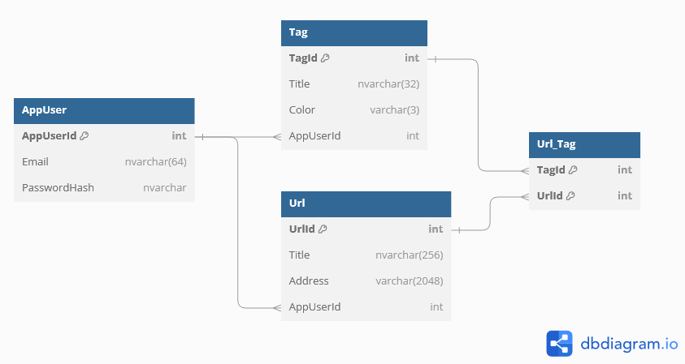
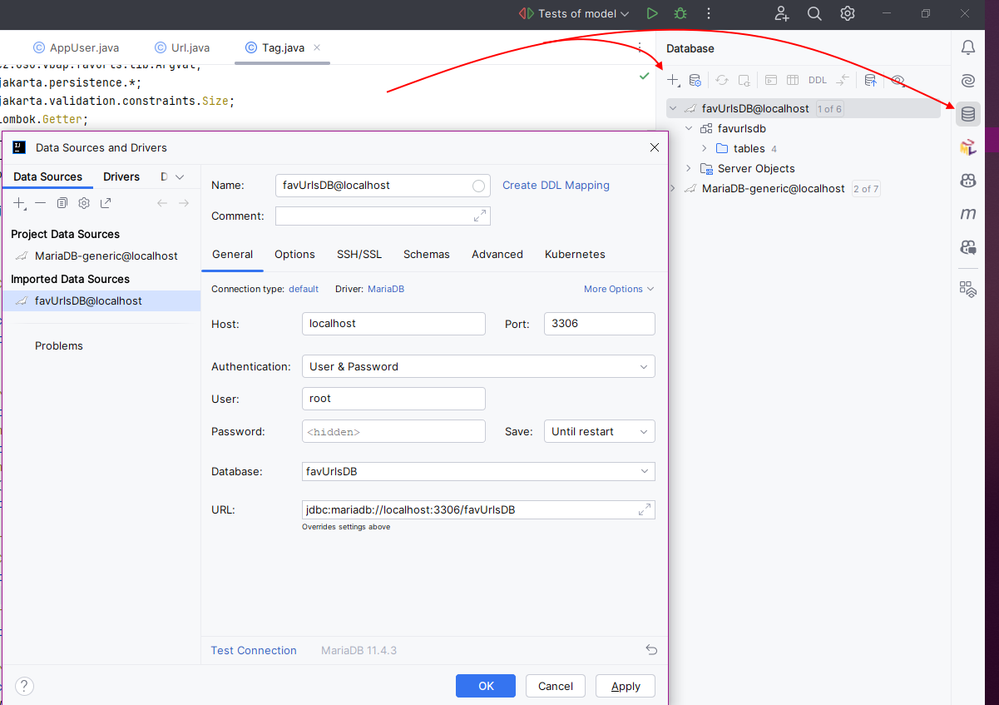
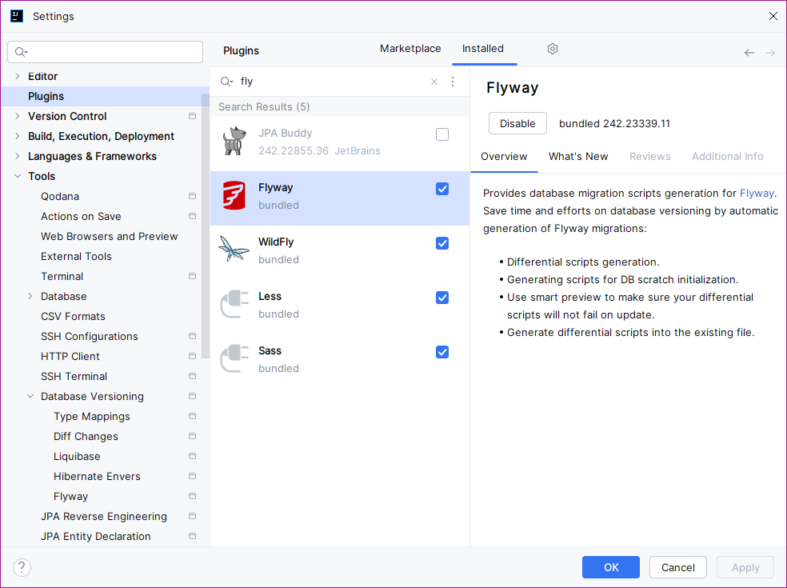
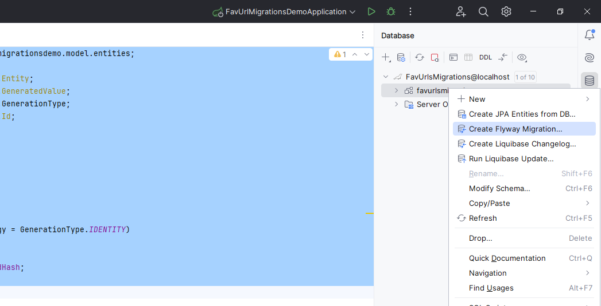
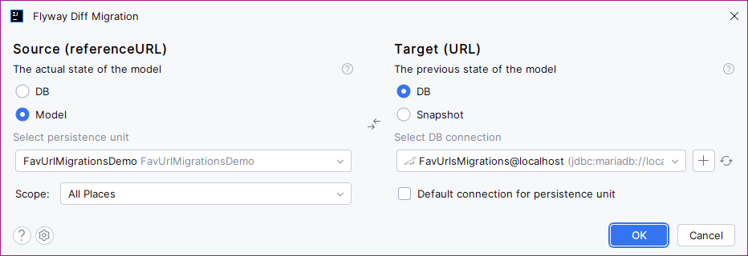
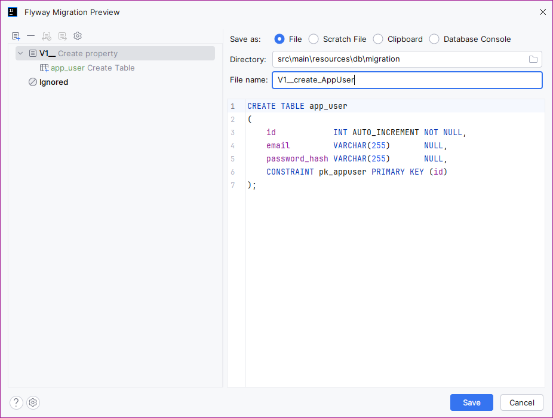

# Database & JPA

## Expected database schema


Database schema is not expected here to be fixed and is a subject of later changes. At the beginning of the project, you cannot define the whole database correctly, as the requirements by the costumer, or restrictions by the technologies may apply. So, at the beginning, only the skeleton of the database project is expected to be created.\
\
However, in our case we will create the whole database at once, so we do not need return to this chapter later in this course.


As the domain, we are creating application users. Every user can have multiple favourite `Url`s. For every url, its `title` and `address` can be set. Moreover, urls can be flagged using `tags`.

The following schema should look like on the next image.




Note that the real database schema will be created by JPA tool. It may not (and probably will not) match exactly the proposed schema. The proposed schema on the image above is only for the illustration.


## New database creation and connection


Here we assume you have your database server already installed and running.


In this tutorial, we will name the database as `FavUrlsDB`. For testing purposes, you can also create `FavUrlsTestDB`.


The way how to create a new database/user differs between different database servers. If you are not sure how to create a new database, check the documentation of you database server.

Some quick hints:

* MS-SQL - you can use direct connection without specified database. Or, you can use _Microsoft SQL Server Management Studio_ to manage database server and its databases.
* MariaDB/MySQL (service) - when installed as a service, you can connect the server using common third-party tools using specified name and password without existing database.
* MariaDB/MySQL (local) - when executed locally, only default user is created (see the tutorial at the end of this page if necessary). You have to connect using command-line tool, create a database and add a specific user to this database to get user/password access.


### Connecting IDEA to the database server

IntelliJ IDEA as bulit in database management support for several database systems. MariaDB is one of them.

In IDEA, you can choose, create and store predefined database connection to a specific database server (and database, if required). In this connection, you can open a console window for SQL commands, which will be submitted to the database server.

To create the database connection in IDEA:

1. From the right narrow menu, select the database icon.
2. In the `Database` window, expand the plus `+` sign and choose `Data source` option.
3. From the list of available database select the requested one (`MariaDB`in our case).
4. In the opened window, submit the required connection data:



You should enter:

* Name - how the connection will be called.
* Host - to set the target database server. Typically, use network computer name, IP address, or `localhost` for the database server on the local machine.
* Port - number of the port where the database server is listening to. Typically, this value is preset to the default with respect to the selected database provider. However, you can adjust this value if required. Default value for MariaDB is 3306.
* Authentication - choose the way how you will authenticate the database user. Common authentications are:
  * None - if no authentication is required.
  * User / Password - to provide username and password.
  * Windows Credentials - to authenticate user using current windows user (typical - but not only for - MS SQL Server).
* User + Password - if this authentication is selected, enter the username and password. Option `Save` defines, how the credentials are stored.
* Database - **as we do not have any yet, leave this blank**.
* URL - common JDBC connection string created by the data entered above.

5. Look for the `Missing Drivers` note above the `Test Connection` note. This button will download required database drivers to the IDEA (**not into the project!**). Once drivers are available, the note will vanish.
6. Test the connection using the `Test Connection` button. If everything is set up correctly, you should see a message confirming a successfull connection.
7. Finally, store the connection.

### Opening IDEA Console for SQL commands + database creation


This section explains how to create a console window to submit SQL commands. Here, we only create a database, but you can use this console window to executed any SQL command later.


Open the context menu over the created connection in the `Database` window on the top right side and choose _New -> Query Console_.

A new window console window will open. Here, you can enter any SQL commands (DDL - `create`, `alter`, ..., DML - `update`, `insert`, ... or DQL - `select`) and execute them. The result will be displayed below the console window.

To create a new database, simply enter and submit:

```sql
create database FavUrlDB;
```

You should see reponse confirming the database creation, like:

```
[2024-10-01 23:12:43] Connected
> create database FavUrlDB
[2024-10-01 23:12:43] 1 row affected in 7 ms
```

### Adjusting IDEA Connection to work with the specific database

As the database is now created, you can:

* Update the connection created in IDEA in the previous step to connect to the newly created database. Open context menu over the connection and select _Properties_. Then, enter the name of the created database.
* Create a new connection in IDEA specific for the newly created database. Follow the steps in the section [Connecting IDEA to the database server](database-and-jpa.md#connecting-idea-to-the-database-server), but this time enter the database name. As you are creating a new connection, remember to adjust the name of the connection appropriatelly.


Again, as mentioned above, we will not create database schema - tables and relations using SQL commands. We will use JPA to create the database schema for us. So, don't create database tables now, you can just close the window.


## JPA

JPA - Java Persistence API - is a framework used to work with relational databases from Java. It is based on the more generic technique called ORM - Object-Relation Mapping, aiming at the point, that the database tables are in object-oriented programming represened by classes and table rows/records are represented as instances of those classes.

A class representing a database table (or a view) is called **Entity.**

To work with entities, we will not use common SQL commands. Instead, we will use predefined mechanism called **Repository** (or JPA Repository), which provides all common operations with entities - storing, loading, updating or deletion.

So, in your project, we will firstly create some entites (moreles covering the schema presented at the beginning) and then we will create repositories to work with those entities.

## Creating entities

An Entity represents a class mapped into the database table. Such class must follow some rules:

* The class is marked with the `@Entity` annotation.
* The class must have a primary key attribute marked with `@Id` annotation.
* The class must have a public parameter-less constructor.
* (Mandatory only in distributed enviroment) The class should implement `Serializable` interface..

### Entity AppUser

To create a simple `AppUser`entity, we will create a class with required annotations and properties:


```java
package cz.osu.vbap.favUrls.model.entities;
import jakarta.persistence.*;
import lombok.*;
import org.jetbrains.annotations.Contract;
import cz.osu.vbap.favUrls.lib.ArgVal;
import java.util.Collection;

@Getter
@Setter
@NoArgsConstructor
@Entity
public class AppUser {
  @Id
  @GeneratedValue(strategy = jakarta.persistence.GenerationType.IDENTITY)
  private int appUserId;
  @Column(unique = true, nullable = false, length = 64)
  private String email;
  private String passwordHash;
}
```


We can see:

* The class is annotated using `@Entity` to define it as an entity class - line 13.
* The class has some fields - lines 17, 19, 20.
* For those fields, getters and setters are automatically created using Lombok annotations - lines 10, 11.
* Primary key is definedusing `@Id` annotation - line 15. Moreover, primary key value is generated by database server - line 16. For more info about this, see [Automatic primary keys in Sidenotes](database-and-jpa.md#automatic-primary-keys).
* There is also more precise definition of email column - it cannot be null and has predefined length - line 18.
* Finally, a public parameterless constructor is generated automatically using Lombok - line 10

We will also add a custom constructor for object creation with e-mail validation, and automatic email conversion to lowercase on save.


```java
// ...
public class AppUser {
  // ...
  
  @Contract(pure = true)
  public AppUser(@NonNull String email) {
    ArgVal.matchRegex(email, ".+@.+", "email");
    this.email = email;
  }

  @PrePersist
  private void prePersistCheck(){
    if (email != null)
      email = email.toLowerCase();
  }
}
```


Here:

* The constructor is provided - lines 5-9. Inside, the e-mail is validated for valid format using [ArgVal class - see Sidenotes](database-and-jpa.md#checking-arguments-argval-class). The constuctor is annotated with a [contract Pure - see Sidenotes](database-and-jpa.md#contract-pure).
* A function `prePersistCheck()` is declared using `@PrePersist` attribute - line 11. This function is invoked just before persisting operation of an instance. In the function, we are simply converting the `email` value to the lowercase.

Finally, we will add relations to the `Url`and `Tag` entity. We do not have such entities yet, we will create them as next:


```java
// ...
public class AppUser {
  // ...
  @OneToMany(mappedBy = "user")
  private Collection<Url> urls;

  @OneToMany(mappedBy = "user")
  private Collection<Tag> tags;
}
```


Here:

* `@OneToMany` annotation says, that **one** appUser will have **many** urls/tags. Because of this, `urls` and `tags` are represented as `java.util.Collection` of respective types. (See hint below.)
* `mappedBy` attribute defines, to which attribute in the target entity is this relation mapping. E.g., according to the line 4/5, it is expected that the `Url` entity will have some attribute `user` as an opposide side of this relation (see `Url`entity and its relations).


If you need a target type for `...Many` relation, you can pick any type supporting several values - most common are `List`, `Set` or `Collection`. JPA will fill the field with the appropriate instance when required.


### Entity Url

The code of `Url` entity is similar:

```java
package cz.osu.vbap.favUrls.model.entities;

import cz.osu.vbap.favUrls.lib.ArgVal;
import jakarta.persistence.*;
import lombok.Getter;
import lombok.NoArgsConstructor;
import lombok.Setter;
import org.jetbrains.annotations.Contract;

import java.util.Collection;
import java.util.List;

@Getter
@Setter
@NoArgsConstructor
@Entity
public class Url {
  @Id
  @GeneratedValue(strategy = jakarta.persistence.GenerationType.IDENTITY)
  private int urlId;
  @Column(nullable = false, length = 256)
  private String title;
  @Column(nullable = false)
  private String address;
}
```

The code is very similar to the previous entity.

Additionally, we create the relation to the `AppUser`:


```java
// ...
public class Url{
  // ...
  @ManyToOne
  @JoinColumn(
    name = "app_user_id", 
    foreignKey = @ForeignKey(name = "FK_url_app_user"))
  private AppUser user;
}
```


Here, we declare:

* The opposite side of the relation to the `AppUser`- `@ManyToOne` as there are may be several Urls for a single user - line 4.
* Moreover, we need to declare, how this relation is stored in the database. We declare a `@JointColumn` representing the relation - line 6. This column will be named `app_user_id`.


If not specified the `name` of the `@JointColumn` will be generated automatically. In most cases it may be fine, but sometime the generated name may be misleading, so you can specify a custom one.



A relation in relational database is represented as a table _constraint_. This constrain must have a unique name. Therefore, the name is automatically generated; and for JPA, it is a random string.

However, in such case, if issue occurs, you will get an error response telling you something like "A constraint A5FLK5LKFJ was violated." telling you directly nothing about the specific issue.

Therefore, we suggest to add a meaningfull name to the constraints too - see the previous listing, line 7.


Now, lets add the first side of M:N relation into the `Url`entity to the `Tag` entity:

```java
// ...
public class Url{
  // ...
  @ManyToMany
  @JoinTable(name = "url_tag",
          joinColumns = @JoinColumn(name = "url_id", foreignKey = @ForeignKey(name = "FK_url_tag_url")),
          inverseJoinColumns = @JoinColumn(name = "tag_id", foreignKey = @ForeignKey(name = "FK_url_tag_tag")))
  private Collection<Tag> tags;
 }
```

Here, the content is very similar. The difference is that we are creating the whole `@JoinTable` with two columns representing M:N relation between `Url` and `Tag`.

At the end, lets add a custom construtor with checks and initialization:

```java
// ...
public class Url{
  // ...
  @Contract(pure = true)
  public Url(AppUser user, String title, String address, Tag... tags) {
    ArgVal.notNull(user, "user");
    ArgVal.notWhitespace(title, "title");
    ArgVal.isTrue(() -> title.length() <= 256, "Title must have 256 characters at most.");
    ArgVal.notWhitespace(address, "address");

    this.user = user;
    this.title = title;
    this.address = address;
    if (tags.length > 0) {
      this.tags = List.of(tags);
    }
  }
}
```

### Entity Tag

Finally, the `Tag`entity is build:


```java
package cz.osu.vbap.favUrls.model.entities;

import cz.osu.vbap.favUrls.lib.ArgVal;
import jakarta.persistence.*;
import jakarta.validation.constraints.Size;
import lombok.Getter;
import lombok.NoArgsConstructor;
import lombok.Setter;
import org.jetbrains.annotations.Contract;

import java.util.Collection;

@Entity
@Getter
@NoArgsConstructor
@Setter
public class Tag {
  private final static int COLOR_LENGTH = 3;

  @Id
  @GeneratedValue(strategy = jakarta.persistence.GenerationType.IDENTITY)
  private int tagId;
  @Column(nullable = false)
  private String title;
  @Column(nullable = false, length = COLOR_LENGTH)
  @Size(min = COLOR_LENGTH, max = COLOR_LENGTH) // this needs "spring-boot-starter-validation" in pom.xml
  private String color;

  @ManyToOne
  @JoinColumn(name = "app_user_id", foreignKey = @ForeignKey(name = "FK_tag_app_user"))
  private AppUser user;

  @ManyToMany(mappedBy = "tags")
  private Collection<Url> urls;

  @Contract(pure = true)
  public Tag(AppUser user, String title, String color) {
    ArgVal.notNull(user, "user");
    ArgVal.notWhitespace(title, "title");
    ArgVal.matchRegex(color, "[0-9a-fA-F]{" + COLOR_LENGTH + "}", "color");

    this.title = title;
    this.user = user;
    this.color = color;
  }
}
```



When creating entities, we are trying to lay as many validations as possible on database consistency checks to be sure that our data are always consistent.

Therefore, at line 26, the `@Size` annotation has been used to ensure that the column length is always 3.

Unfortunately, this annotation is not a part of common JPA libraries. To use it, we need to extend the Maven with a new library as follows:


```xml
<!-- for advanced SQL validation -->
<dependency>
  <groupId>org.springframework.boot</groupId>
  <artifactId>spring-boot-starter-validation</artifactId>
</dependency>
```

## Creating Repositories

JPA based repositories inherits from the interface `JpaRepository` with two generic arguments. The first one is the entity type, the second is the type of the primary key. So, in our case, we can simply create three repository interfaces:

```java
package cz.osu.vbap.favUrls.model.repositories;

import cz.osu.vbap.favUrls.model.entities.AppUser;
import org.springframework.data.jpa.repository.JpaRepository;

public interface AppUserRepository extends JpaRepository<AppUser, Integer> {
    Optional<AppUser> getByEmail();
}
```

```java
package cz.osu.vbap.favUrls.model.repositories;

import cz.osu.vbap.favUrls.model.entities.AppUser;
import cz.osu.vbap.favUrls.model.entities.Url;
import org.springframework.data.jpa.repository.JpaRepository;

import java.util.Collection;

public interface UrlRepository extends JpaRepository<Url, Integer> {
    Collection<Url> getByUser(AppUser appUser);
}
```

```java
package cz.osu.vbap.favUrls.model.repositories;

import cz.osu.vbap.favUrls.model.entities.Tag;
import org.springframework.data.jpa.repository.JpaRepository;

public interface TagRepository extends JpaRepository<Tag, Integer> {}
```


Note that repositories are **interfaces**. The specific implementation is provided by JPA on request when needed.



Note that before was mandatory to append `@Repository` annotation. Now, it is added by default and is not needed.


You can specify additional custom query methods into the interfaces when needed - like `getByEmail()` in `AppUserRepository`. For those methods, you can use specific JPA-query-language JPQL to specify the query request.


Introduction to custom JPA queries



Exhaustive explanation of JPA query methods



Exhaustive explanation of JPA query methods using JPQL


## Testing

### Using CommandRunner

TODO

### Using Unit Tests

TODO

## Database Migrations

In the context of applicaition development, database migration is the process of evolving your database schema in a controlled, versioned manner. Just like versioning code, database versioning involves keeping track of changes made to the database structure (schema) over time, ensuring that your development, testing, and production environments stay in sync.

Typically, each change to the database schema (like adding a column, modifying a table, or creating an index) is written as a migration script. These scripts are assigned a version number (e.g., `V1__Create_User_Table.sql`, `V2__Add_Email_To_User.sql`), allowing the system to track which migrations have been applied. As the application evolves, new migration scripts are added. When the application is deployed, the migration tool automatically applies any new changes (if necessary) to bring the database to the latest version. This ensures that your database schema is always compatible with your application code. Also, many migration tools also provide a way to rollback migrations in case an error is found. This can revert the database to a previous version.

In the Java and Spring Boot ecosystem, two primary tools are commonly used for database migration and versioning: _Flyway_ and _Liquibase_. Both tools are well-integrated with Spring Boot and provide features to manage database schema changes efficiently.

In this tutorial, we will work with _Flyway_.


Flyway is typically closely connected and related to another common JPA support addon in Idea - _Jpa Buddy_. Also, lot of tutorials show database migration based on Flywy and JPA Buddy.&#x20;

Unfortunately, up to today (2024-10-03) JPA Buddy has a bug causing crash on many IDEA instalations. So, in this tutorial, we will use direct IDEA support for Flyway and database migrations.



Flyway website



JPA Buddy website


### Adding Flyway support to IDEA

Idea in Ultimate edition has already installed _Flyway_ plugin already. Check if the plugin is among your active plugins, or install it if necessary.



### Adding Flyway support to the project

Initially, you need to add required dependencies into the Maven (`pom.xml`):

```xml
<!-- core functionality -->
<dependency>
    <groupId>org.flywaydb</groupId>
    <artifactId>flyway-core</artifactId>
</dependency>
<!-- database-server-specific dependency -->
<dependency>
    <groupId>org.flywaydb</groupId>
    <artifactId>flyway-mysql</artifactId>
</dependency>
```

Note that the first dependency is no related to the selected database server. Otherwise, the second dependency is database specific and needs to be adjusted for the selected database. As _MariaDB_ is a fork of _MySQL_ database, it uses the same dependecy here.

### Project preparation

Create a new SpringBoot project with dependencies:

* Lombok
* Spring Data JPA
* MariaDB Driver
* Flyway Migrations

What is new in the created project is a new folder structure at `src/java/main/resources/db/migrations`. The migrations SQL scrips will be stored here.

Next, set up the configration in `application.properties` file:


```properties
spring.application.name=FavUrlMigrationsDemo

# JPA properties
spring.datasource.url=jdbc:mariadb://localhost:3306/FavUrlsMigrations
spring.datasource.username=root
spring.datasource.password=sa
spring.datasource.driver-class-name=org.mariadb.jdbc.Driver
spring.jpa.hibernate.ddl-auto=none

# Flyway properties
spring.flyway.baseline-on-migrate=true
spring.flyway.locations=classpath:db/migration
```


Note here that we **disabled JPA database re-creation on startup** at line 8. The Flyway mechanism itself will care for the database state.

Now, create a new database called `FavUrlsMigrations` and create IDEA database connection to this DB.


Note: As the database is empty at the beginning, there is no need to create specific initial migration script.

However, for non-empty database right now you should do the initial Flyway migration.


### Create a migration

Firstly, lets create a simple entity in the code (simiarly to the previous context):

```java
// ...

@Getter
@Setter
@Entity
public class AppUser {
    @Id
    @GeneratedValue(strategy = GenerationType.IDENTITY)
    private int id;
    private String email;
    private String passwordHash;
}
```

Now, we can create a first migration - from the empty state to the state with respect to the current entities defined in our project.

Open the context menu over IDEA database connection and select *Create Flyway Migration...*:



The new window will appear with the source and target definition. As a source (the required state) we address the current entities definitions in the project (set by default). As a target (current state of the model) we address a current database state, which is now empty (set by defualt). Then we confirm the dialog.



A new window - Migration Preview Window - will appear. Here we check the correctness of the generated SQL script and **set the migration name**. Then name should contain the version number (generated automatically) and a description of the migration operation:



Once confirmed, there will be a new file in the `.../db/migrations` folder.

## Applying the migration


## Sidenotes

### Automatic primary keys

There are several ways, how the uniqueness of the primary key (PK) can be handled. The most common approaches are:

* Autogenerated PK - JPA will create its own, unique primary key value whenever needed. The programmer should never provide his own primary key. How this can be achieved:
  * IDENTITY - The database will generate the primary key value automatically w.r.t. to the values in the table. This approach is not supported by all database systems and is typical for MySQL, MariaDB or MS-SQL.
  * SEQUENCE - The database will generate the primary key value based on some sequencer object producing unique sequence of data. This approach is typical for Oracle, PostgreSQL or H2.
  * TABLE - JPA will create custom table to hold the sequence/next value for the key for the table by its own. This approach is database independent and is used, when no other option is available.
  * AUTO - JPA will determine the appropriate mechanism from the three above on its own.
* UUID/GUID - a primary key will be represented by a random (or partially random) 128bit long sequence of bytes. It may be generated by a programmer and provided on persist operation, or generated by a database and returned as a primary key. The way how the value is generated is trying to ensure that there are no conflicts between randomly generated primary keys. This approach is typically used in distributed environment.
* A programmer will provide a primary key
  * Data-related primary key - this approach is typically used when the primary key is not represented by a numerical sequence, but is related to a data (production number, insurance number, etc.) In this case, the value of the primary key is defined by the stored data.&#x20;
  * Numerical-sequence primary key - this approach means that a programmer must provide the primary key value and ensure its uniqueness. This is typcially related to some significant performance loss caused by table lock handling and is not recommended.&#x20;

A non-data related primary key is a preferred approach, because:

* You are not related to the data definition. If in the future a situation changes and the previously unique value used as primary key loses its uniqueness, it envokes a significant architecture changes in the whole application. If the primary key is generated automatically by the database system, its value is independent on data and not affected by their definition change.
* You can still ensure the uniquess of the required non-primary key data by adding the UNIQUE constraint in the database.
* You avoid the complex primary key, which can be harder to maintain and handle. Again, to ensure that some attribute set is unique, the UNIQUE constraint can be used.

To generate the value automatically, a `@GeneratedValue` annotation with the chosen `strategy` can be used, as can be seen in the examples above.

### Database creation using MariaDB command line tools

You may download MariaDB server as a ZIP file and simply extract it into the folder. As such server is not installed as a OS service/daemon, it is not initially configured.


This tutorial is aimed on Windows OS. However, it is applicable on Linux-based systems.


To configure the server and create a database initially, several steps must be taken:

1. Navigate to the MariaDB `bin` folder with executables
2. Do an initial installation by executing:

```powershell
.\mariadb-install-db.exe
```

3. Start the MariaDB server instance using (this proces should remain running - you cannot enter additional commands):

```powershell
.\mariadbd.exe
```

4. Open **a new** console window and navigate to the same folder.
5. In the new window, connect to the server as a _root_ user using:

```powershell
.\mariadb.exe -u root
```

6. Create a new user with a password:

```sql
create user USERNAME identified by 'PASSWORD';
```

7. Optionally, you can check the user was created and see password token:

```sql
select password('USERNAME');
```

8. Now, create a new database using SQL:

```sql
create table DATABASE_NAME;
```

9. Finally, grand access rights to the database for your user:

```sql
grant all PRIVILEGES on DATABASE_NAME.* to 'USERNAME' with grant OPTION;
```

9. Apply the changed privileges:

```sql
flush privileges;
```

Now, you should be able to connect to the `DATABASE_NAME` with username `USERNAME` and password `PASSWORD`.

### Checking arguments - ArgVal class

It is important to check the arguments of the functions - at least for the public ones, as you must ensure that there is no nonsense incoming into the function.&#x20;

Typically, you check those arguments at the beginning of the function using a sequence of `if` conditions followed by `throw` statements with the exception data. As `if` statements typically multiline, the code of the function easily became long, especially for more complex checks:

```java
// ...
public class Tag {
  // ...

  public Tag(AppUser user, String title, String color) {
    if (user == null)
      throw new IllegalArgumentException("User is null");
    if (title == null || title.trim().isEmpty())
      throw new IllegalArgumentException("Title is empty.");
    if (color.matches("[0-9a-fA-F]{" + COLOR_LENGTH + "}"))
      throw new IllegalArgumentException("Color does not match the specified regular expression.");
	
    // ...
  }
}
```

Even in this example the intro checks immediatelly look complicated.

Therefore, it is common to use some additional library or create a custom one to get rid of the complex `if` calls.

The updated code may look like:

```java
// ...
public class Tag {
  // ...

  public Tag(AppUser user, String title, String color) {
    ArgVal.notNull(user, "user");
    ArgVal.notWhitespace(title, "title");
    ArgVal.matchRegex(color, "[0-9a-fA-F]{" + COLOR_LENGTH + "}", "color");
	
    // ...
  }
}
```

The code above is easier to read - not in the meaning that it you need to read less data for understanding, but in the meaning that you can optically "skip" all the lines starting with `ArgVal` and ignore them, what cannot be so easily visually achieveable in the case of more complex `if` blocks.

Of course, if the validation section is too long, you can consider the creation of some sanity checking function to remove all the checks, like:

```java
// ...
public class Tag {
  // ...

  public Tag(AppUser user, String title, String color) {
    validateArgs(user, title, color);
	
    // ...
  }
}
```

However, in most cases a custom method validating arguments for another method may be an overkill.

In our case we created a simple `ArgVal` class, which contains some basic methods, but will be extended in the future. Check the Git repository for the most current implementation if necessary:

```java
package cz.osu.vbap.favUrls.lib;

import org.jetbrains.annotations.Contract;

import java.util.function.Function;
import java.util.function.Supplier;

public class ArgVal {
  @Contract(pure = true)
  public static void notNull(Object value, String argName) {
    if (value == null) {
      throw new IllegalArgumentException(argName + " must not be null");
    }
  }

  @Contract(pure = true)
  public static void matchRegex(String text, String regex, String argName) {
    if (text == null || !text.matches(regex)) {
      throw new IllegalArgumentException(argName + " must match regex " + regex + ". Invalid value: " + text);
    }
  }

  @Contract(pure = true)
  public static void notWhitespace(String text, String argName) {
    if (text == null || text.trim().isEmpty()) {
      throw new IllegalArgumentException(argName + " must not be empty.");
    }
  }

  public static void isTrue(Supplier<Boolean> validator, String argName) {
    boolean res;
    try{
      res = validator.get();
      if (!res) throw new IllegalArgumentException(argName + " failed to pass 'isTrue' validation");
    }catch (Exception ex){
      throw new IllegalArgumentException(argName + " crashed when passing 'isTrue' validation");
    }
  }
}
```

The explanation will be provided for the last method `isTrue` only.

The method accepts a special argument - `Supplier<Boolean>`, what in general is a function accepting no arguments and returning bool value. The purpose of this supplier is to return true or false. If `false` value is returned, the method `isTrue` will invoke an exception.

The method is supposed to be called with a lambda expression of type `Supplier<Boolean>`, that is accepting no arguments and returning null, e.g.:

```java
ArgVal.isTrue(() -> title.length() <= 256, "Title is too long.");
```


A **lambda expression** in Java is a way to express instances of single-method interfaces (functional interfaces) in a more concise and readable way. Introduced in **Java 8**, lambda expressions help reduce the amount of boilerplate code, especially when working with functional-style operations on collections, like `map`, `filter`, and `forEach`.



More detailed explanation of Java Lambda expressions


### @Contract Pure

The `@Contract` annotation with `pure=true` in Java is part of JetBrains' **IntelliJ IDEA** annotations, used primarily for static code analysis. It provides additional metadata about a method's behavior to help tools like IntelliJ IDEA and static analyzers understand the method better.

`@Contract` is an annotation used to define a **method contract** — a formal description of the method's behavior in terms of input/output relationships, side effects, and nullability. This allows tools to perform advanced static analysis and catch potential bugs by understanding how the method behaves under various conditions.

When `pure=true` is specified in the `@Contract` annotation, it indicates that the method is **pure**, meaning it:

* **Does not modify** any state (either of the object or any external state).
* **Has no side effects**.
* Always returns the same result when given the same inputs (idempotent).


A **side effect** occurs when a function or method performs an action that affects the outside world or modifies some state beyond returning a value. Side effects are typically any observable effects outside the function itself, like modifying global or external variables, performing I/O operations, or altering the state of objects.


So, you can use `@Contract(pure=true)` to mark functions without supposed side effect, what can improve further code analysis and make code more error-proof.

However, to use this annotation, you need to add additional dependency to `pom.xml` file:

```xml
<dependency>
    <groupId>org.jetbrains</groupId>
    <artifactId>annotations</artifactId>
    <version>RELEASE</version>
</dependency>
```


Java @Contract explanation in more detail


