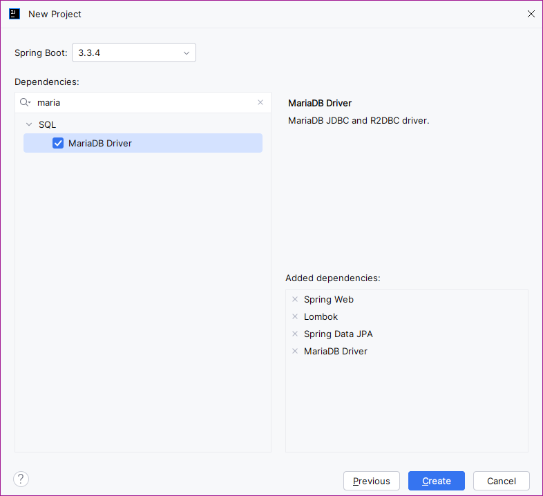

# Project creation

## **Requirements**

To create the project, the following prerequisities must be fulfilled:

* IntelliJ IDEA Ultimate edition - _Ultimate_ edition is required for easy database management, Maven project management and easy _Spring Boot_ project creation.
* Java 23 - can be installed during the project creation. However, the project will work for some older Java versions.
* MariaDB database server - you can use any other relation database server (PostgreSQL, MySQL, MS-SQL, or other). Note that if you use different server, you must adjust some parts of the code (mainly Maven database driver dependencies). Moreover, in some servers some features may not be available.


IntelliJ IDEA development environment download



MariaDB database server download


## Project creation

Start IDEA.

In IDE, select _File -> New -> Project_.

In the opened window select _Spring Boot_.


Set:

* Name for the project - we set `favUrls`,
* Location where the project will be stored,
* Create GIT repository (checked),
* use `Java` language,
* use `Maven` as building tool,
* set appropriate group and artifact,
* adjust package name,
* set Java 23 JDK - if not available, expand the menu and choose `Download`,
* set Java version to 23,
* choose packaging to JAR.



On the next page, you will select the added dependencies (libraries) (those can be adjusted later). At the beginning, we will need:

* `Spring Web` to support web applications,
* `Lombok` to help write the code,
* `Spring Data JPA` to support ORM in Java,
* `MariaDB` driver to connect to the selected specific database system.


In newest IDEA editions, you can simply adjust the preset dependencies by opening the `pom.xml` file and selecting `Edit starters` from the `<dependencies>` section.



The most important technologies will be explained now.

### Maven

Maven is a build automation and project management tool primarily used for Java projects. It helps developers manage a project’s build, dependencies, documentation, and reporting in a standardized way. Here's a breakdown of Maven's key aspects:

1. **Project Management**: Maven uses a Project Object Model (POM) file (pom.xml), which contains information about the project, such as dependencies, plugins, build settings, and project metadata.
2. **Dependency Management**: Maven automatically downloads and manages the libraries and dependencies your project needs. It fetches them from a central repository (Maven Central) and caches them locally.
3. **Build Automation**: It can compile, package, test, and deploy the project, based on predefined or custom configurations.
4. **Convention Over Configuration**: Maven follows a set of conventions to make it easier to set up and organize project structures, reducing the need for custom build scripts.
5. **Plugin System**: Maven is highly extensible with plugins, which can handle everything from compiling code to deploying applications to servers.

We will use Maven primarily as a dependency manager .Spring Boot and IDEA sometimes updates the dependencies for you. However, you can add any required dependency by adjusting the `pom.xml` file and its `dependencies` section. To find the correct library/dependency, you can use _Maven Repository_.


Maven Repository Website


### Lombok

Lombok is a Java library that helps reduce boilerplate code by automatically generating commonly used methods like getters, setters, `toString()`, `equals()`, `hashCode()`, and constructors during the compilation process. It simplifies the development process by allowing developers to focus on business logic rather than writing repetitive code.

For example, the following code will automatically create class with constructor, getters and setters:

```java
import lombok.Getter;
import lombok.Setter;
import lombok.NoArgsConstructor;
import lombok.AllArgsConstructor;

@Getter
@Setter
@NoArgsConstructor
@AllArgsConstructor
public class Person {
    private String name;
    private int age;
}

```

Lombok avoids common-code sequence repetition and simplifies the code overall.

To add the Lombok library into the project, you must add the dependency into Maven's `pom.xml` file:

```xml
<dependency>
    <groupId>org.projectlombok</groupId>
    <artifactId>lombok</artifactId>
    <optional>true</optional>
</dependency>
```

Then, you need to enable Lombok preprocessing support in IDEA in project settings (_File -> Settings_) and selecting _Build, Execution, Deployment -> Compiler -> Annotation Processors -> Enable annotation processing (checked) + Obtain processors from class path_.



Project Lombok Website


### JPA

**JPA (Java Persistence API)** is a specification for managing relational data in Java applications. It provides a standardized way to map Java objects (entities) to relational database tables and interact with the database using object-oriented concepts. JPA is part of the Java EE (now Jakarta EE) specification but can be used in any Java application, including standalone and Spring applications.

The key objects are _Entities_ and _Repositories_.

An entity in JPA represents a table in a relational database, and each instance of the entity corresponds to a row in the table.

```java
// A simple entity
@Entity
public class Person {
    @Id
    private Long id;
    private String name;
    private int age;
}
```

Repositories abstract away the need to write boilerplate code for common CRUD operations. A repository interface can extend `JpaRepository` to gain access to various operations like `findAll()`, `save()`, `delete()`, etc.

```java
public interface PersonRepository extends JpaRepository<Person, Long> {
}
```
