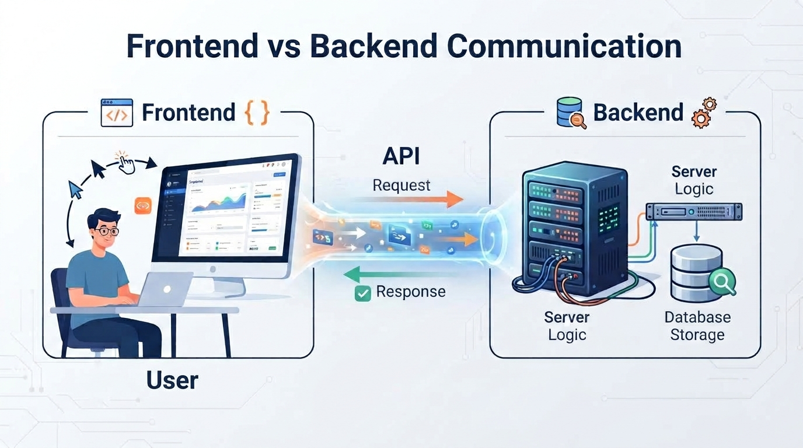
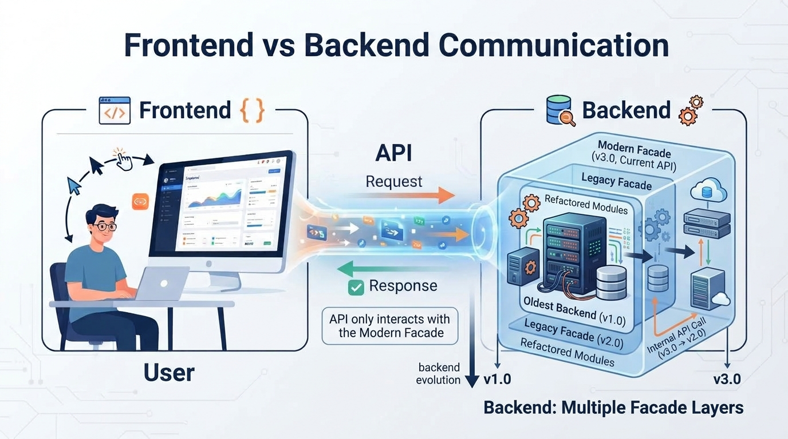

# Backend

_Backend_ is the part of an application that operates behind the user interface and is responsible for processing data, executing business logic, and communicating with external systems. While users interact with the _frontend_ through a web browser, desktop application, or mobile application, the _backend_ performs the operations required to make the application function correctly.

A typical software system can be divided into two major parts: the frontend and the backend. The frontend is responsible for presenting information to the user and collecting user input. The backend receives requests from the frontend, processes them according to the application's rules, and returns the appropriate results. For example, when a user submits a login form, the frontend sends the entered credentials to the backend, which verifies them against stored user data and decides whether access should be granted.

One of the primary responsibilities of the backend is the implementation of business logic. Business logic represents the rules and processes that define how the application behaves. In an online store, business logic may include calculating discounts, validating payments, checking product availability, or processing orders. By keeping these rules on the server side, the application ensures consistency, security, and maintainability.

Another important responsibility of the backend is data management. Historically, backend systems were primarily designed as a layer between the user interface and a database, focusing mainly on creating, reading, updating, and deleting records. This functionality is commonly referred to as CRUD operations (Create, Read, Update, Delete). Modern backend architectures, however, are often organized into multiple services, each responsible for a specific business domain or functionality. In a microservice architecture, these services are deployed independently and communicate through APIs, messaging systems, or events. For example, user management, order processing, notifications, and payment handling may each be implemented as separate services. This approach improves scalability, maintainability, and the ability to develop and deploy different parts of the system independently. Although data storage remains an important responsibility, modern backends are primarily focused on implementing business capabilities through specialized and loosely coupled services.

Backend systems frequently expose their functionality through APIs (Application Programming Interfaces). An API defines a set of endpoints that can be accessed by client applications. The frontend sends requests to these endpoints, usually through HTTP or HTTPS protocols, and receives responses in formats such as JSON or XML. Modern web applications commonly rely on REST APIs or GraphQL APIs to facilitate communication between different software components.

Security is a critical aspect of backend development. The backend is responsible for authenticating users, authorizing access to resources, protecting sensitive information, and preventing unauthorized operations. Security measures often include password hashing, token-based authentication, encryption, input validation, and protection against common attacks such as SQL injection and cross-site scripting.

Backend applications are commonly developed using server-side technologies such as C#, Java, Python, JavaScript (Node.js), PHP, or Go. In the .NET ecosystem, backend systems are frequently implemented using ASP.NET Core, which provides frameworks and libraries for building web applications and APIs. These backend applications can run on physical servers, virtual machines, containers, or cloud platforms.

A backend system often communicates not only with frotnend, but also with external services. Examples include payment gateways, email services, cloud storage solutions, identity providers, and third-party APIs. In modern distributed systems, multiple backend services may cooperate through network communication, forming a service-oriented or microservice architecture.

In summary, the backend can be understood as the operational core of an application. It processes requests, enforces business rules, manages data storage, provides security, and coordinates communication between various software components. While users rarely interact with it directly, the backend is essential for delivering the functionality and reliability that modern applications require.

### Backend wrapping

Understanding the backend architecture is important when working on the system. It is very common, that for the historical reasons and the backward compatibility, the original backend implementation is hidden behind a facade pattern, which provides a new, updated interface to the underlying functionality. This abstraction isolates consumers from internal implementation details and reduces the impact of changes within the legacy codebase.

The new backend is generated around this facade layer rather than replacing it directly. As a result, the facade serves as the integration point between the existing implementation and the newly generated components. A solid understanding of the facade's responsibilities and exposed interfaces is therefore essential for extending, maintaining, or troubleshooting the system. Any modifications to the generation process or surrounding architecture must take into account the contractual behavior provided by the facade to ensure compatibility with both existing and newly generated functionality.&#x20;

This is the reason, why the backend is typicaly more complicated to handle and manage than frontend, which is very often replaced almost completely (w.r.t.  to the implementation).

## Architecture

The backend of an application can be built using a wide variety of technologies, depending on the requirements of the project, expected workload, performance goals, and organizational preferences. Common backend platforms include .NET, Java, Node.js, Python, PHP, and Go, each offering different advantages in terms of performance, ecosystem, development speed, and maintainability. Modern backend systems often expose their functionality through REST or GraphQL APIs and communicate with databases, external services, and messaging systems. Regardless of the selected technology stack, the primary responsibility of the backend is to implement business logic, manage data, enforce security, and provide reliable services to client applications.

Here, we define some common terms, which will be later used in this course.

### Cluster

A cluster is a group of interconnected servers that work together as a single system. Instead of relying on a single machine, an application can be distributed across multiple servers within the cluster. This approach improves availability, scalability, and fault tolerance. If one server fails, other servers in the cluster can continue providing the service, minimizing downtime. Clusters are commonly used in cloud environments, container orchestration platforms such as Kubernetes, and high-availability enterprise systems.

### Load Balancer

A load balancer is a component responsible for distributing incoming network traffic across multiple servers. Its primary purpose is to prevent any single server from becoming overloaded while ensuring optimal utilization of available resources. Load balancers can route requests using various algorithms, such as round-robin, least connections, or resource-based selection. By spreading the workload across multiple instances of an application, load balancers improve performance, increase reliability, and support horizontal scaling of services.

### Serverless

Serverless is a cloud computing model in which developers focus on implementing application logic while the cloud provider manages the underlying infrastructure. Although servers still exist, their provisioning, scaling, maintenance, and operation are handled automatically by the platform. Applications are typically executed as event-driven functions that run only when needed. This model reduces operational overhead and allows organizations to pay only for the actual resources consumed during execution. Popular serverless platforms include Azure Functions, AWS Lambda, and Google Cloud Functions.

## Interfaces

An interface is a programming construct that defines a contract between software components. It specifies which methods, properties, or operations must be provided by a class, but it does not define how these operations are implemented. The primary purpose of an interface is to separate behavior from implementation, allowing different classes to provide their own implementations while exposing a common set of functionalities. This approach improves flexibility, maintainability, and extensibility of software systems. Interfaces are widely used in object-oriented programming to support polymorphism, dependency injection, and loose coupling between components. For example, multiple classes may implement the same interface for data storage, while internally using different technologies such as SQL databases, file systems, or cloud storage services.

### REST

REST (Representational State Transfer) is an architectural style commonly used for communication between applications over the HTTP protocol. In a REST-based system, functionality is exposed through resources identified by unique URLs. Clients interact with these resources by sending HTTP requests such as GET, POST, PUT, or DELETE. Each request contains all information necessary for processing, making the communication stateless. REST APIs typically exchange data in JSON format because it is lightweight, human-readable, and widely supported. Due to its simplicity, scalability, and interoperability, REST has become the dominant approach for communication between web applications, mobile applications, and backend services.

One of the disadvantages of the REST approach is the overhead associated with HTTP communication. Every request requires the establishment and processing of an HTTP transaction, including headers, routing, authentication, and response handling. When a large number of requests are exchanged between clients and services, this overhead can increase network traffic and consume additional bandwidth. For applications that require frequent communication or real-time data exchange, the repeated transmission of HTTP metadata may negatively impact performance and increase latency compared to more efficient communication protocols or persistent connection-based solutions.

### WebSocket

WebSocket is a communication protocol that enables persistent bidirectional communication between a client and a server. Unlike traditional REST communication, where a new HTTP request must be sent whenever data is needed, a WebSocket connection remains open after it is established. Both the client and the server can send messages at any time without waiting for a request from the other side. This significantly reduces latency and communication overhead. WebSockets are commonly used in applications that require real-time interaction, such as chat systems, multiplayer games, live dashboards, video conferencing platforms, and financial trading systems.

One of the main disadvantages of WebSocket communication is the need to maintain a persistent connection between the client and the server. Unlike stateless HTTP requests, each connected client consumes server resources for the entire duration of the connection, which can increase memory and infrastructure requirements when supporting a large number of concurrent users. WebSocket communication is also more complex to implement, monitor, and secure than traditional REST APIs. Additional challenges may arise from connection handling, reconnection logic, load balancing, firewall compatibility, and debugging, making WebSocket solutions generally more difficult to operate and maintain in enterprise environments.

### Pipes

Pipes are a form of inter-process communication (IPC) provided by **the operating system** that allows data to be transferred directly between processes. A pipe acts as a communication channel where one process writes data and another process reads it. This mechanism enables programs to exchange information without using files, network communication, or shared databases. Pipes are widely used in operating systems to connect independent applications and create processing chains where the output of one program becomes the input of another.

Operating systems typically support two types of pipes. Anonymous pipes are generally used for communication between related processes, such as a parent process and its child process. Named pipes, sometimes referred to as FIFOs, provide a persistent communication endpoint identified by a name and can be used by unrelated processes. Pipes offer a simple and efficient communication mechanism for local systems, but they are typically limited to sequential data streams and are not well suited for complex communication patterns requiring random access or bidirectional data exchange.

#### Filters

In this context, a process connected to a pipe is often referred to as a _filter_. A filter reads data from its input, performs a transformation or processing step, and writes the result to its output. By combining multiple filters through pipes, complex processing workflows can be built from simple, independent components. This concept is especially common in Unix-like operating systems, where commands can be chained together to process data step by step. Such architectures promote modularity, reusability, and a clear separation of responsibilities between individual processing stages.

Operating systems typically support two types of pipes. Anonymous pipes are generally used for communication between related processes, such as a parent process and its child process. Named pipes, sometimes referred to as FIFOs, provide a persistent communication endpoint identified by a name and can be used by unrelated processes. Pipes offer a simple and efficient communication mechanism for local systems, but they are typically limited to sequential data streams and are not well suited for complex communication patterns requiring random access or bidirectional data exchange.
